# Proyecto #2: Paradigma funcional

**Lenguajes de Programación GR 2**

**Autores:** 

Fabián Alejandro Sánchez Durán

Santiago Villarreal Arley 

Randy Baeza Ramírez

---

### Enlace de GitHub

El siguiente enlace (<https://github.com/Villarley/Proyecto2-Funcional>)
es el repositorio de GitHub utilizado para la realización del proyecto.
Todos los estudiantes fuimos contribuidores en el proyecto y lo hicimos
en el branch main. Algunos trabajamos en branches separadas, y luego
hicimos un merge usando Pull Requests.

### Pasos de instalación del programa

1.  Instalar Stack (una herramienta para desarrollo de proyectos con
    Haskell,
    <https://docs.haskellstack.org/en/stable/install_and_upgrade/>)

**En MacOS:**

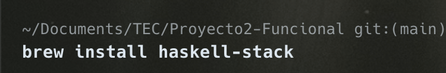

**En Windows:**

winget install Haskell.Stack

1.  Si es la primera vez usando algo relacionado a
    Haskell, descargue GHC (recomendado usar GHCup).

**En MacOS:**

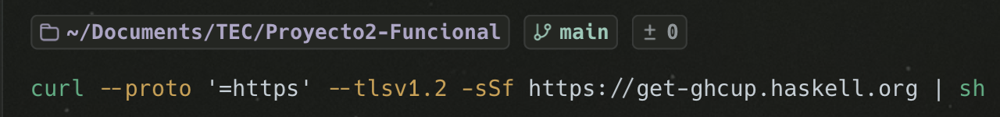

**En Windows:**

Seguir esta guía (<https://www.haskell.org/ghcup/install/>).

1.  Correr lo siguiente para compilar el programa, y luego ejecutarlo:

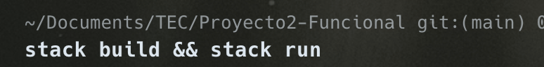

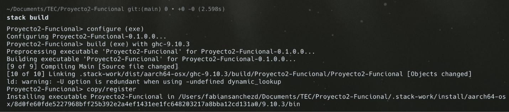

---

### Manual de Usuario

#### Menú Principal

Al ejecutar el programa (haciendo stack run), se muestra el siguiente
menú:

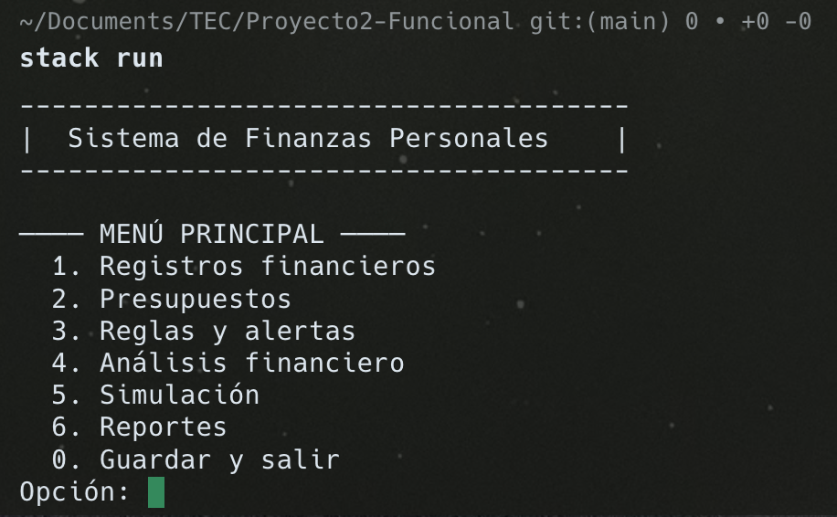

**1. Registros financieros**

Aquí se pueden agregar registros, listar todos los registros, filtrarlos
o eliminarlos.

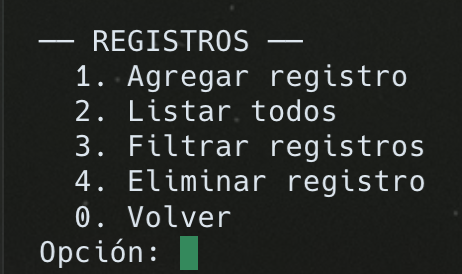

Al darle click en Agregar registro, se pedirá el tipo de registro,
monto, categoría, fecha, descripción del registro y etiquetas. Las
categorías no son necesarias para Ingreso o Inversión.

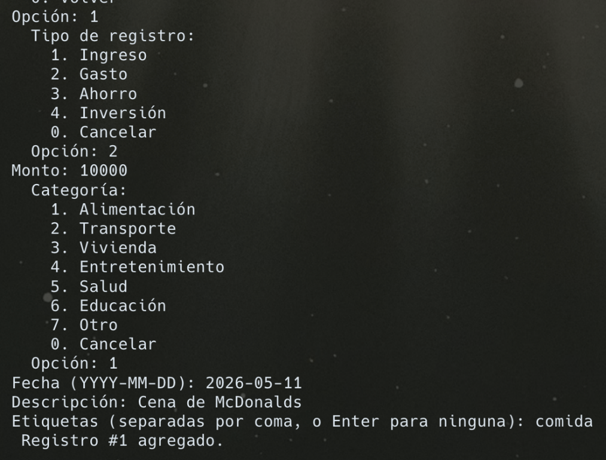

Al darle click en Listar todos, se verán todos los registros
financieros.

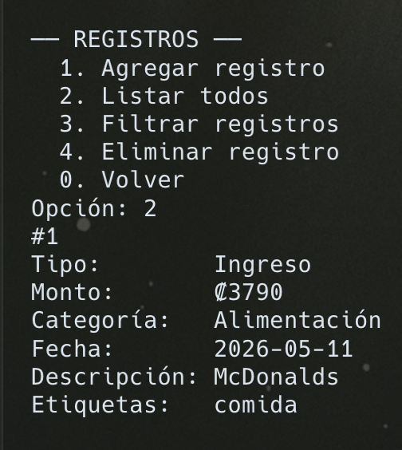

Al darle click en Filtrar registros, se puede filtrar por tipo,
categoría y fecha. Y dentro de cada filtro, se elige que por qué
criterio se va a filtrar.

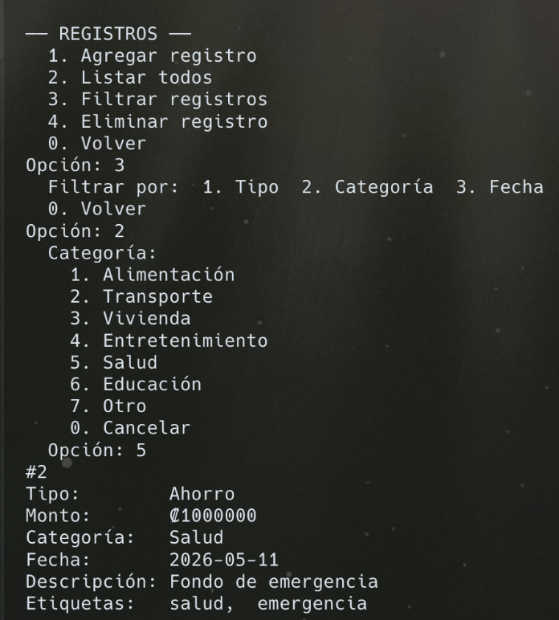

Al darle click en Eliminar registro, saldrán todos los registros y al
poner el ID se elimina un registro.

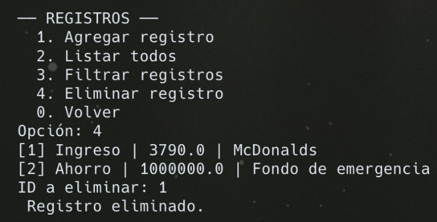

**2. Presupuesto**

Al darle click a la opción de presupuesto, sale el menú de presupuesto:

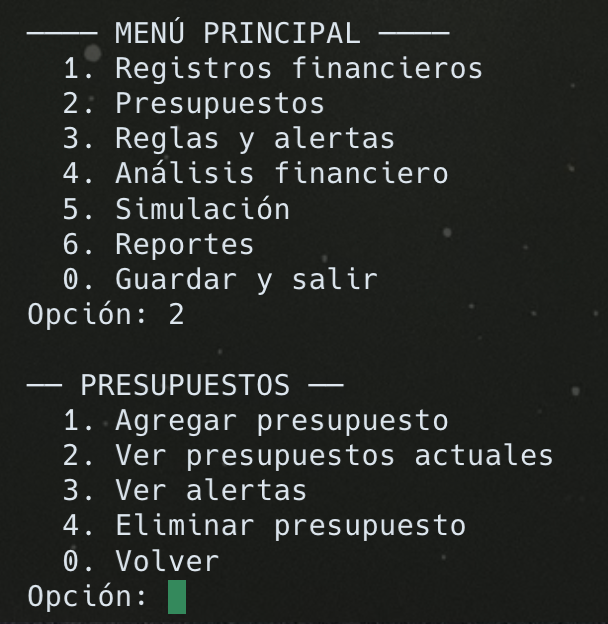

Al darle click a Agregar presupuesto, necesitaremos añadir la categoría
y el límite mensual impuesto para esa categoría.

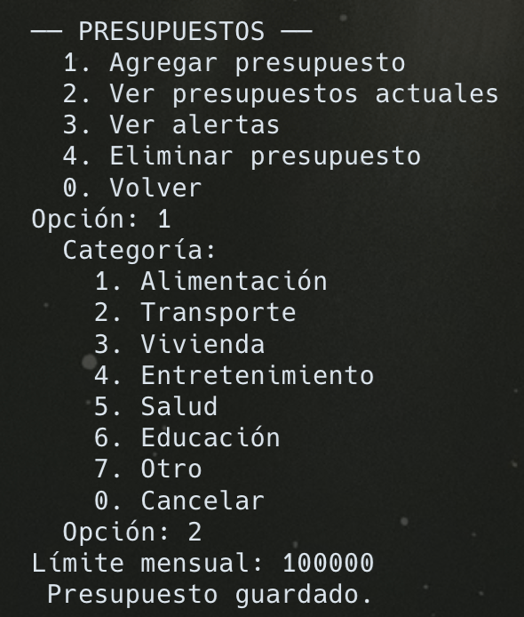

Al darle click a Ver presupuestos actuales, se listarán todos los
presupuestos que actualmente están implantados.

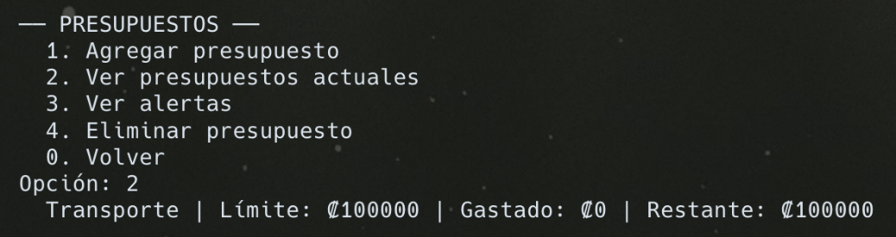

Por ejemplo, cuando hay algo gastado sale así:

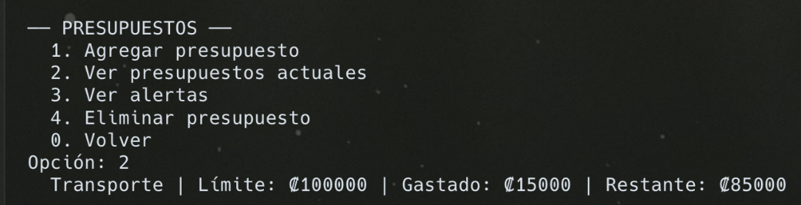

Al darle click en Alertas, saldrán las alertas de que un presupuesto fue
excedido.

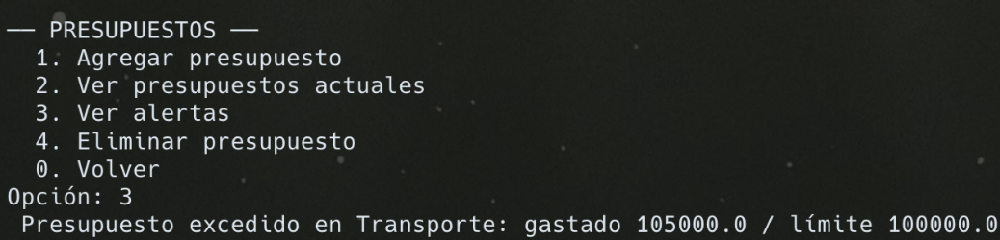

Finalmente, se pueden eliminar presupuestos.

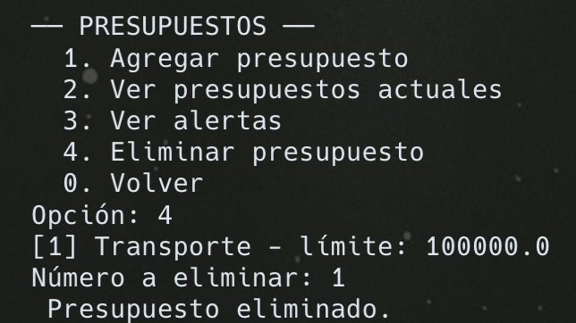

**3. Reglas y alertas**

Al darle click en Agregar regla, se puede crear una regla. Se necesita
una categoría, un umbral o monto y el tipo de alerta, si es un ahorro
menor al umbral o una advertencia de que se pasa del umbral de la regla.

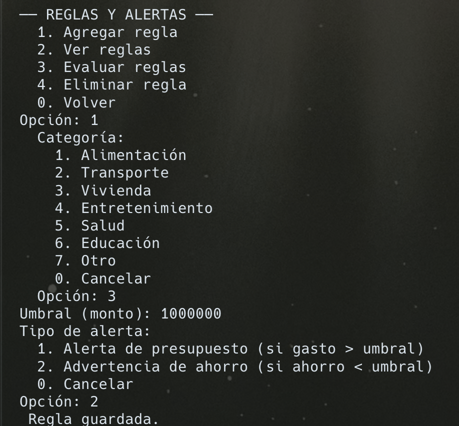

Se pueden listar todas las reglas, dandole click a Ver reglas.

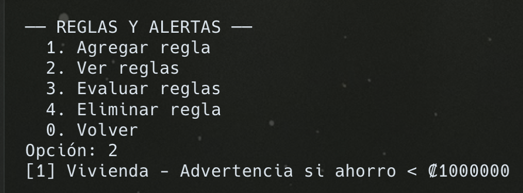

Se pueden evaluar las reglas (como si está activada, por qué) dandole
click a Evaluar reglas.

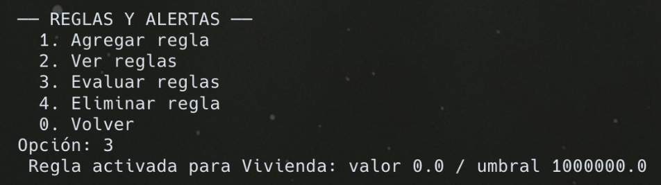

Finalmente, se pueden eliminar reglas dandole click a Eliminar regla.

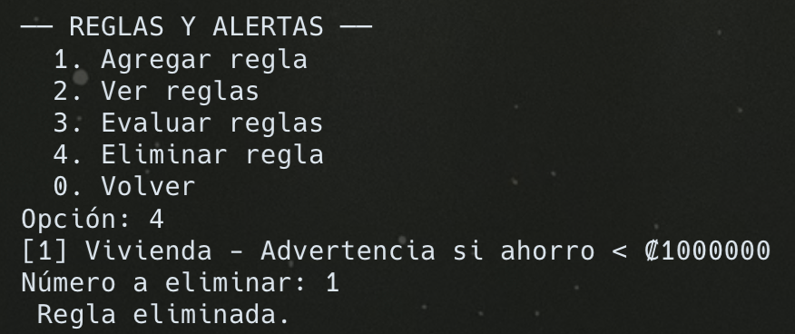

**4. Análisis financiero**

Al darle click en análisis financiero, veremos este menú:

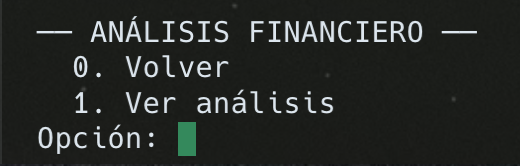

Al darle click en Ver análisis, se ve lo siguiente. Se menciona el flujo
de caja mensual, tendencia de gastos mensuales, gasto promedio
(proyección), desglose de gastos y categoría de más impacto.

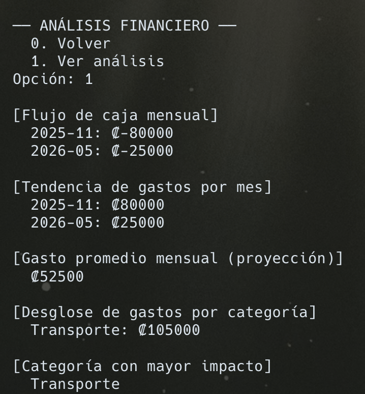

**5. Simulación**

Al darle click a Simulación, se mostrará el siguiente menú:

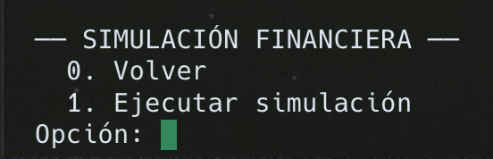

Para ejecutar una simulación, se toma el gasto mensual promedio, y se le
consulta al usuario el porcentaje de reducción de gastos en porcentaje.
Ahí le damos al usuario el gasto mensual reducido para el ahorro extra
mensual.

Además, entonces, le pedimos al usuario a cuantos meses quiere proyectar
su ahorro acumulado y se le da el resultado.

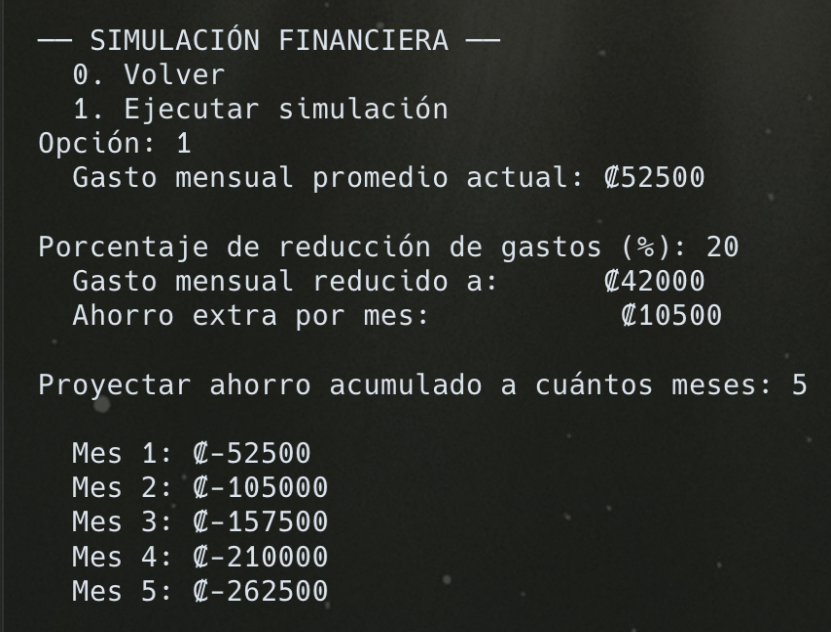

**6. Reportes**

Al darle click a Reportes, veremos el siguiente menú:

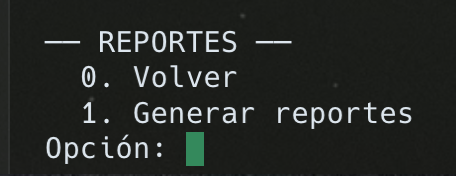

Aquí, el usuario pone el año y el mes, y mostramos un resumen y
categoría con mayor gasto. Además, se puede hacer una comparación de
periodos así que el usuario puede escribir 2 periodos, y se escribe la
diferencia en gastos durante ambos periodos (aumento o decremento) con
respecto al reporte que se pidió inicialmente.

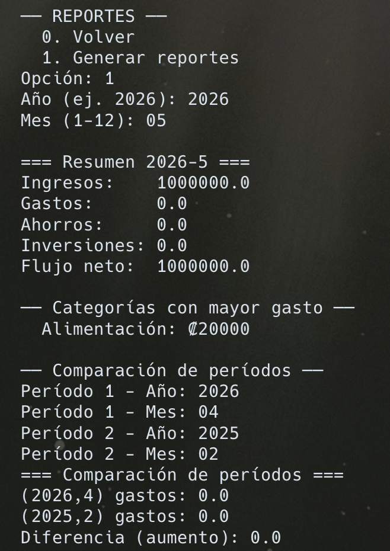

**7. Guardar y salir**

Al darle Guardar y salir, se guarda el avance en el programa y se
cierra.

 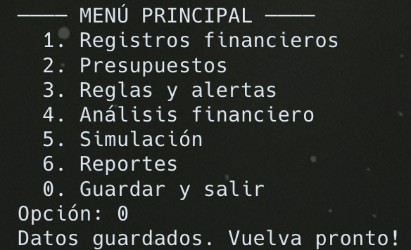

--- 
### Arquitectura lógica utilizada

El sistema fue desarrollado utilizando una arquitectura modular basada
en programación funcional, donde los módulos tienen responsabilidades
específicas. Esto permite mantener el código organizado, reutilizable y
fácil de mantener.

La estructura lógica del proyecto se divide en los siguientes módulos:

**Módulo Main.hs**

Es el punto de entrada principal del sistema.\
Se encarga de:

- Mostrar el menú principal.

- Gestionar la interacción con el usuario.

- Llamar las funciones correspondientes de cada módulo según la opción
  seleccionada.

Este módulo coordina el funcionamiento general del programa.

 

**Módulo Types.hs**

Contiene la definición de los tipos de datos utilizados en el sistema.

Aquí se definen estructuras como:

- Registros financieros

- Presupuestos

- Reglas financieras

Se utilizaron tipos data para modelar la información de forma
estructurada y segura.

 

**Módulo Storage.hs**

Se encarga del manejo de archivos y persistencia de datos.

Sus responsabilidades incluyen:

- Guardar información en archivos .txt

- Leer información almacenada

Archivos utilizados:

- datos.txt

- presupuestos.txt

- reglas.txt

Este módulo permite que la información permanezca guardada entre
ejecuciones del programa.

 

**Módulo Registros.hs**

Administra todas las operaciones relacionadas con los registros
financieros.

Funciones principales:

- Agregar registro

- Eliminar registro

- Listar registros

- Filtrar registro por tipo, categoría y fecha.

 

**Módulo Presupuestos.hs**

Gestiona los presupuestos financieros por categoría.

Permite:

- Crear presupuestos

- Comparar gastos reales contra presupuestos

- Detectar excesos de gasto

 

**Módulo Analisis.hs**

Realiza el análisis financiero del sistema.

Entre las principales funcionalidades se encuentran:

- Cálculo del flujo de caja mensual

- Análisis de tendencias de gasto

- Identificación de categorías con mayor impacto financiero

- Proyecciones financieras basadas en datos históricos

 

**Módulo Simulacion.hs**

Permite realizar simulaciones financieras.

El usuario puede:

- Simular reducción de gastos en porcentajes

- Calcular proyecciones de ahorro

 

**Módulo Reglas.hs**

Administra reglas financieras definidas por el usuario.

Ejemplos:

- Alertar cuando una categoría supera cierto monto

- Advertir cuando el ahorro es menor al esperado

Las reglas son evaluadas automáticamente utilizando los registros
financieros almacenados.

 

**Módulo Reportes.hs**

Genera reportes y resúmenes financieros.

Incluye:

- Resumen mensual

- Comparación entre períodos

- Categorías con mayores gastos

---

### Explicación del funcionamiento

El sistema funciona mediante un menú interactivo en consola que permite
al usuario seleccionar distintas operaciones financieras.

**Flujo general del programa**

1.  Al iniciar el programa, se carga la información almacenada en los
    archivos.

2.  El usuario visualiza el menú principal.

3.  Dependiendo de la opción elegida, el sistema llama al módulo
    correspondiente.

4.  Los cambios realizados se guardan nuevamente en archivos para
    mantener la persistencia de los datos.

 

**Registro de información financiera**

El usuario puede registrar distintos tipos de movimientos financieros:

- Ingresos

- Gastos

- Ahorros

- Inversiones

Cada registro almacena:

- Monto

- Categoría

- Fecha

- Descripción

- Etiquetas múltiples

Los datos son almacenados en el archivo datos.txt.

 

**Manejo de presupuestos**

El sistema permite crear presupuestos por categoría.

Funcionamiento:

1.  El usuario define un límite de gasto.

2.  El sistema compara automáticamente los gastos registrados con el
    presupuesto.

3.  Si el gasto supera el límite establecido, se genera una alerta.

La información se almacena en presupuestos.txt.

 

**Análisis financiero**

El sistema realiza un análisis financiero, mostrando cómo resultado:

- Flujo de caja mensual

- Tendencia de gastos por mes

- Proyección de gasto mensual

- Desglose de gastos por categoría

- Categoría con mayor impacto

 

**Simulación financiera**

El usuario puede ejecutar simulaciones para prever escenarios futuros.
Las simulaciones incluyen:

- Reducir gastos en cierto porcentaje

- Calcular cuánto dinero podría ahorrar en varios meses

El sistema toma los datos actuales y aplica operaciones matemáticas para
mostrar resultados aproximados.

 

**Sistema de reglas**

Las reglas financieras permiten generar alertas.

Funcionamiento:

1.  El usuario define una condición.

2.  El sistema revisa los registros financieros.

3.  Si la condición se cumple, se muestra una alerta.

Ejemplo: "Si los gastos de comida superan ₡100000 -\> generar alerta".

Las reglas se almacenan en reglas.txt.

 

**Generación de reportes**

El módulo de reportes organiza la información financiera, generando
reportes. Los reportes incluyen:

- Balance mensual

- Comparación de períodos

- Categorías con más gastos

Esto permite al usuario comprender mejor su situación financiera.

